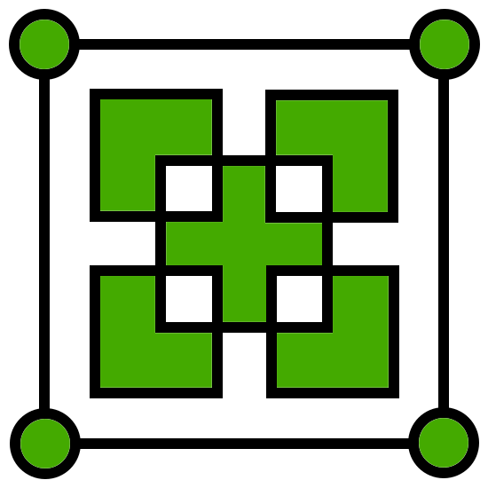

# Chip Union

**Our goal is to build a world where everyone can touch, learn and develop open source chips**. With the booming development of open instruction set architectures (such as RISC-V), we have always believed that open source chips based on it will become another thing that can have a profound impact on the computing revolution after the Internet era. In order to better enable as many people as possible to access and love open source chips, just like the great contribution [Arduino](https://www.arduino.cc) has made to open source MCUs - **breaking the barriers between design, hardware, and software**, we created the Chip Union organization.
